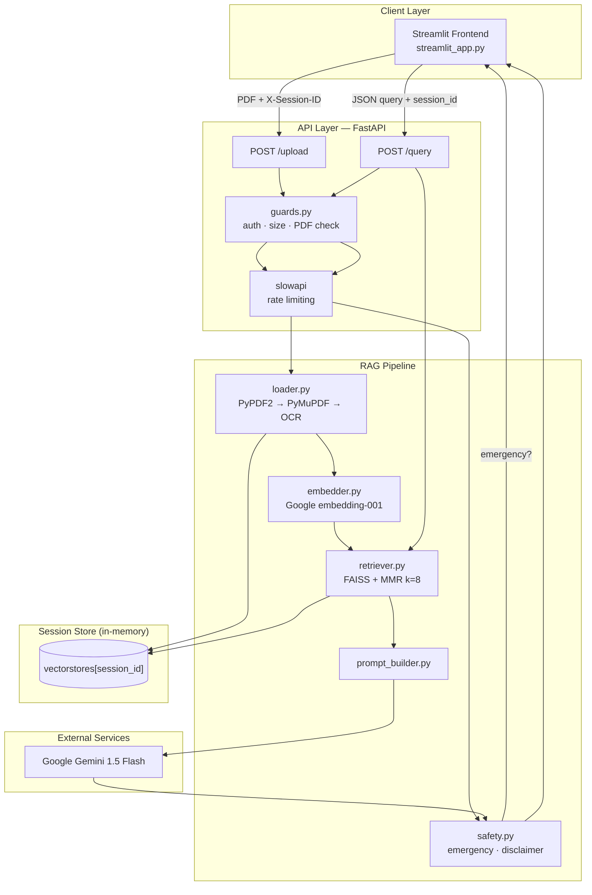
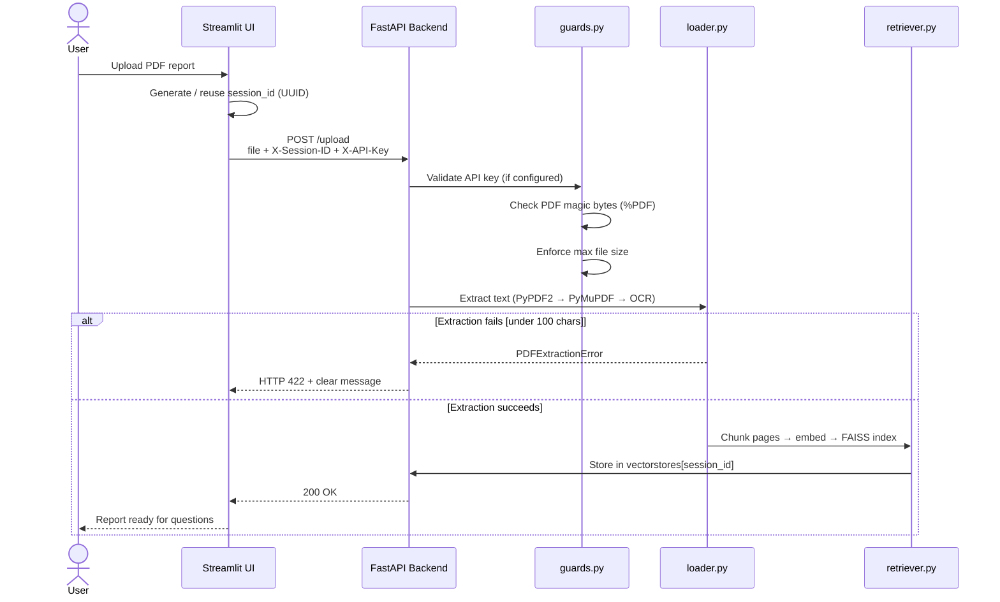
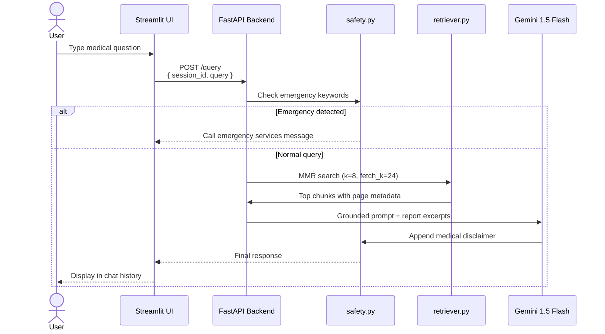

# MediSage

**Making medical reports understandable for everyone.**

MediSage is an AI-powered healthcare assistant that helps patients interpret diagnostic PDF reports — blood tests, lipid panels, imaging summaries, and more — in plain language. Upload a report, ask follow-up questions, and get cautious, context-grounded explanations powered by retrieval-augmented generation (RAG).

> **Disclaimer:** MediSage is for educational and informational purposes only. It is **not** a substitute for professional medical advice, diagnosis, or treatment. Always consult a licensed healthcare provider.

---

## Table of contents

- [Live demo](#live-demo)
- [What MediSage does](#what-medisage-does)
- [System architecture](#system-architecture)
- [End-to-end workflow](#end-to-end-workflow)
- [Tech stack](#tech-stack)
- [Project structure](#project-structure)
- [Getting started](#getting-started)
- [Environment variables](#environment-variables)
- [API reference](#api-reference)
- [Production deployment](#production-deployment)
- [Security & reliability](#security--reliability)
- [Enhancements shipped](#enhancements-shipped)
- [Roadmap](#roadmap)
- [Contributing](#contributing)

---

## Live demo

| Service | URL |
|---------|-----|
| **Frontend** (Streamlit) | [medisagegit-m7fgqgz8ez4teqzk2zysja.streamlit.app](https://medisagegit-m7fgqgz8ez4teqzk2zysja.streamlit.app) |
| **Backend** (FastAPI) | [medisage-51pi.onrender.com](https://medisage-51pi.onrender.com) |

<p align="center">
  
</p>

---

## What MediSage does

Millions of people receive lab results but struggle to understand them. MediSage closes that gap by:

1. **Extracting text** from uploaded medical PDFs (text-based, layout-heavy, or scanned).
2. **Indexing the report** into a searchable vector store (FAISS + Google embeddings).
3. **Retrieving relevant sections** when you ask a question (MMR search over report chunks).
4. **Generating a plain-language answer** with Gemini 1.5 Flash, grounded in your report.
5. **Applying safety guardrails** — emergency detection, no definitive diagnoses, mandatory disclaimers.

**Typical questions MediSage can help with:**

- "Is my hemoglobin within the normal range?"
- "What does elevated LDL cholesterol mean?"
- "Can you explain my liver function test results?"

---

## System architecture



---

## End-to-end workflow

### Upload workflow



### Query workflow



---

## Tech stack

| Layer | Technology | Purpose |
|-------|------------|---------|
| Frontend | [Streamlit](https://streamlit.io/) | Upload UI, chat interface, session management |
| Backend | [FastAPI](https://fastapi.tiangolo.com/) | REST API, validation, middleware |
| LLM | Gemini 1.5 Flash | Plain-language medical explanations |
| Embeddings | Google `embedding-001` | Vector encoding for RAG |
| Vector DB | FAISS | Similarity search over report chunks |
| Retrieval | MMR (Max Marginal Relevance) | Diverse, relevant chunk selection |
| PDF parsing | PyPDF2, PyMuPDF, Tesseract OCR | Text + layout + scanned PDF support |
| Rate limiting | slowapi | Abuse and cost protection |
| Deployment | Render (API) + Streamlit Cloud (UI) | Production hosting |

---

## Project structure

```
MediSage/
├── backend/
│   ├── main.py                 # FastAPI app — /upload, /query
│   ├── start.sh                # Render start command
│   ├── requirements.txt
│   └── rag/
│       ├── loader.py           # Tiered PDF extraction
│       ├── embedder.py         # Google Generative AI embeddings
│       ├── retriever.py        # FAISS index + MMR retrieval
│       ├── prompt_builder.py   # Grounded LLM prompts
│       ├── guards.py           # Auth, upload limits, PDF validation
│       └── safety.py           # Emergency gate + disclaimers
├── frontend/
│   ├── streamlit_app.py        # Streamlit chat UI
│   └── requirements.txt
├── .env                        # Local secrets (not committed)
├── .gitignore
└── README.md
```

---

## Getting started

### Prerequisites

- **Python 3.10+**
- **Google API key** with Gemini API enabled — [Get one here](https://aistudio.google.com/apikey)
- **Git**
- **Optional:** [Tesseract OCR](https://github.com/tesseract-ocr/tesseract) for scanned/image-based PDFs

### 1. Clone the repository

```bash
git clone https://github.com/Ujjwal0207/MediSage.git
cd MediSage
```

### 2. Configure environment

Create a `.env` file in the **project root**:

```env
GOOGLE_API_KEY=your-google-api-key

# Recommended for production
MEDISAGE_API_KEY=your-shared-secret-key
MEDISAGE_MAX_UPLOAD_MB=10
```

### 3. Run the backend

```bash
cd backend
python -m venv .venv
source .venv/bin/activate        # Windows: .venv\Scripts\activate
pip install -r requirements.txt
uvicorn main:app --reload --host 0.0.0.0 --port 8000
```

Backend runs at **http://localhost:8000**. Interactive API docs: **http://localhost:8000/docs**.

### 4. Run the frontend (new terminal)

```bash
cd frontend
python -m venv .venv
source .venv/bin/activate
pip install streamlit requests
export MEDISAGE_API_URL=http://localhost:8000
export MEDISAGE_API_KEY=your-shared-secret-key   # if set on backend
streamlit run streamlit_app.py
```

Frontend opens at **http://localhost:8501**.

### 5. Use the app

1. Open the Streamlit UI in your browser.
2. Upload a PDF medical report.
3. Wait for the success confirmation.
4. Ask a question about your report.
5. Review the AI response and chat history.

---

## Environment variables

| Variable | Required | Default | Description |
|----------|----------|---------|-------------|
| `GOOGLE_API_KEY` | Yes | — | Google Generative AI key for Gemini + embeddings |
| `MEDISAGE_API_KEY` | No | — | Shared API key; when set, all requests must send `X-API-Key` |
| `MEDISAGE_MAX_UPLOAD_MB` | No | `10` | Maximum PDF upload size in megabytes |
| `MEDISAGE_API_URL` | No | Render URL | Backend URL used by the Streamlit frontend |

### Streamlit Cloud secrets (production frontend)

```toml
MEDISAGE_API_URL = "https://medisage-51pi.onrender.com"
MEDISAGE_API_KEY = "your-shared-secret-key"
```

### Render environment (production backend)

Set `GOOGLE_API_KEY`, `MEDISAGE_API_KEY`, and optionally `MEDISAGE_MAX_UPLOAD_MB` in the Render dashboard.

---

## API reference

### `POST /upload`

Upload and index a medical PDF for the current session.

**Headers**

| Header | Required | Description |
|--------|----------|-------------|
| `X-Session-ID` | Yes | UUID v4 session identifier |
| `X-API-Key` | If configured | Must match `MEDISAGE_API_KEY` |

**Body:** `multipart/form-data` with field `file` (PDF)

**Rate limit:** 5 requests / minute / IP

**Success (200)**

```json
{ "message": "PDF uploaded and processed successfully." }
```

**Errors:** `400` invalid PDF · `401` bad API key · `413` file too large · `422` extraction failed · `429` rate limited

---

### `POST /query`

Ask a question about the uploaded report.

**Headers**

| Header | Required | Description |
|--------|----------|-------------|
| `X-API-Key` | If configured | Must match `MEDISAGE_API_KEY` |

**Body (JSON)**

```json
{
  "session_id": "550e8400-e29b-41d4-a716-446655440000",
  "query": "Is my hemoglobin normal?"
}
```

**Rate limit:** 20 requests / minute / IP

**Success (200)**

```json
{
  "response": "Your hemoglobin is ... **Disclaimer:** This response is for educational purposes only..."
}
```

**Errors:** `400` invalid session · `401` bad API key · `429` rate limited · `{ "error": "No PDF uploaded yet for this session." }`

---

## Production deployment

### Backend — Render

1. Create a **Web Service** connected to this repo.
2. Set **Root Directory** to `backend`.
3. **Build command:** `pip install -r requirements.txt`
4. **Start command:** `uvicorn main:app --host 0.0.0.0 --port $PORT`
5. Add environment variables (see table above).
6. **Optional (OCR):** Add Tesseract to the build environment for scanned PDF support.

### Frontend — Streamlit Cloud

1. Deploy `frontend/streamlit_app.py` from this repo.
2. Set **Main file path:** `frontend/streamlit_app.py`
3. Add secrets: `MEDISAGE_API_URL`, `MEDISAGE_API_KEY`
4. Ensure `MEDISAGE_API_KEY` matches the backend value.

### Production checklist

- [ ] `GOOGLE_API_KEY` set on Render
- [ ] `MEDISAGE_API_KEY` set on **both** Render and Streamlit Cloud
- [ ] `MEDISAGE_MAX_UPLOAD_MB` configured appropriately
- [ ] Tesseract installed if expecting scanned PDFs
- [ ] CORS origins tightened if you add a custom domain (currently `*`)

---

## Security & reliability

| Feature | Implementation |
|---------|----------------|
| Session isolation | Each browser session gets a UUID; vector stores are keyed by `session_id` |
| Query privacy | Questions sent via `POST` JSON body — never in URL query strings |
| API authentication | Optional shared key via `X-API-Key` header |
| Upload validation | PDF magic-byte check + configurable size limit |
| Rate limiting | 5 uploads/min, 20 queries/min per IP |
| Medical safety | Emergency keyword short-circuit, cautious prompts, mandatory disclaimer |
| Temp file cleanup | Uploaded PDFs deleted after processing |
| Extraction guard | Fails loudly if PDF yields insufficient text (no silent empty index) |

**Known limitation:** Vector stores are in-memory and reset on server restart or Render cold start. Users must re-upload after a cold start. Persistent storage is planned.

---

## Enhancements shipped

MediSage has gone through two major hardening passes:

### Enhancement 1 — Security & medical safety

| Area | Improvement |
|------|-------------|
| Multi-user privacy | Per-session vector stores instead of one shared global index |
| Query privacy | Switched from `GET /query` to `POST /query` with JSON body |
| Disk hygiene | Temp PDF files deleted after every upload |
| Medical safety | Emergency detection, safer prompts (no definitive diagnoses), mandatory disclaimer on every response |

### Enhancement 2 — Production guards & RAG quality

| Area | Improvement |
|------|-------------|
| API protection | Optional API key auth, rate limiting, PDF validation, upload size caps |
| PDF extraction | Tiered pipeline: PyPDF2 → PyMuPDF → Tesseract OCR fallback |
| Empty PDF handling | HTTP 422 error when extraction yields too little text |
| Chunking | Increased to 1200 chars / 200 overlap with page metadata preserved |
| Retrieval | MMR search with 8 diverse chunks (was 3 similar chunks) |
| Documentation | README aligned with actual stack (Gemini 1.5 Flash, Google embeddings) |

**Curious about the RAG math?** Read our [Medical RAG Benchmarks](benchmarks.md) to see exactly why `1200/200` chunking and `MMR k=8` outperforms naive retrieval on complex lab reports.

---

## Roadmap

| Phase | Status | Description |
|-------|--------|-------------|
| **Phase 1** | ✅ Complete | AI report chatbot with RAG |
| **Phase 2** | Planned | Medical triage — emergency vs routine vs self-care |
| **Phase 3** | Planned | Doctor recommendation by specialty and location |
| **Phase 4** | Planned | Helper/assisted mode for elderly patients |
| **Phase 5** | Planned | Mobile apps and SMS/low-bandwidth access |

---

## Contributing

Contributions are welcome. To propose a change:

1. Fork the repository.
2. Create a feature branch: `git checkout -b feature/your-feature`
3. Commit your changes and open a pull request.

Ideas we'd love help with: persistent vector storage, hybrid retrieval, triage logic, UI/UX improvements, and test coverage.

---

## License & disclaimer

MediSage is intended for **educational and informational use**. It must not be used as a replacement for qualified medical professionals. The authors are not liable for medical decisions made based on AI-generated content.

Always seek advice from a licensed doctor for diagnosis and treatment.
